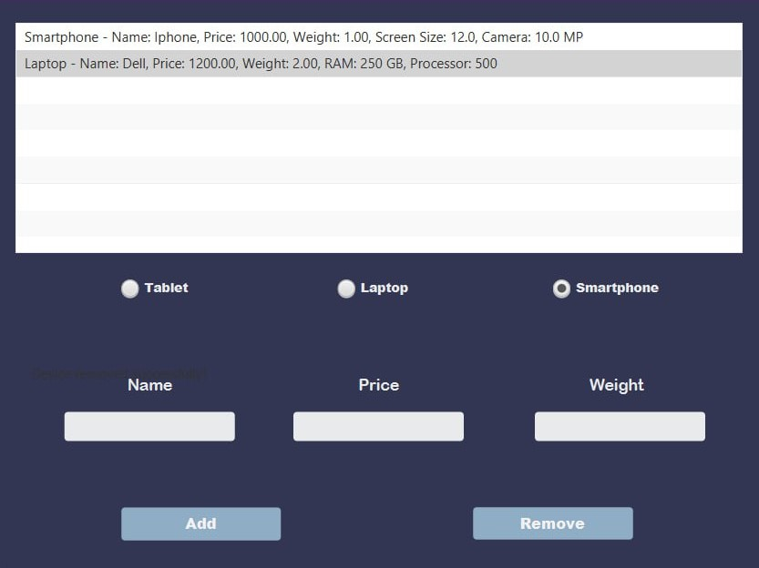

# Documentation
## Description: 
This JavaFX application is designed for managing various devices such as smartphones, laptops, and tablets. 
Users can add, remove, and view devices with different characteristics like name, price, weight, and unique parameters for each type of device.

## HelloApplication
Description: The main class of the application that launches the JavaFX interface.
Methods:
start(Stage stage): Loads the FXML file and displays the application window.
main(String[] args): Entry point of the application.

## HelloController
Description: The controller responsible for managing user interactions and the application's logic.
*Fields:*
RadioButton rdSmartphone, rdLaptop, rdTablet: Radio buttons for selecting the type of device.
TextField textScreenSize, textCameraResolution, textRamSize, textProcessorType, textBatteryLife: Input fields for device characteristics.
CheckBox checkHasStylus: Checkbox for selecting the presence of a stylus for the tablet.
Label label: Label for displaying error and success messages.
ListView<String> listView: List to display added devices.

## Methods:
initialize(): Sets up initial values and hides additional fields.
onDeviceSelected(ActionEvent event): Displays additional fields based on the selected device type.
onAddClick(ActionEvent event): Adds a new device to the list, validating the input.
onRemoveClick(ActionEvent event): Removes the selected device from the list.
hideAdditionalFields(): Hides additional input fields.
clearFields(): Clears all input fields.

## Device (abstract class)
Description: Base class for all devices.
*Fields:*
protected String name: The name of the device.
protected double price: The price of the device.
protected double weight: The weight of the device.
Methods:
getName(): Returns the name of the device.
getPrice(): Returns the price of the device.
getWeight(): Returns the weight of the device.
toString(): Returns a string representation of the device.

## Laptop
Description: Class representing a laptop, which inherits from Device.
Fields:
private final int ramSize: Size of the RAM.
private final String processorType: Type of the processor.
*Methods:*
getRamSize(): Returns the RAM size.
getProcessorType(): Returns the type of processor.
toString(): Returns a string representation of the laptop.

## Smartphone
Description: Class representing a smartphone, which inherits from Device.
*Fields:*
private final double screenSize: Size of the screen.
private final double cameraResolution: Camera resolution.

*Methods:*
toString(): Returns a string representation of the smartphone.

## Tablet
Description: Class representing a tablet, which inherits from Device.
Fields:
private final double batteryLife: Battery life duration.
private final boolean hasStylus: Presence of a stylus.

*Methods:*
toString(): Returns a string representation of the tablet.

## User Interface Description
*Main UI Components:*
**Device List (ListView):** Displays all added devices.
**Radio Buttons (RadioButton):** Allow users to select the type of device (Smartphone, Laptop, Tablet).
*Buttons (Button):*
**"Add"** - adds a new device to the list.
**"Remove"** - removes the selected device from the list.
**Input Fields (TextField):** For entering name, price, weight, and specific characteristics (screen size, RAM, processor type, battery life).
**Checkbox (CheckBox):** For selecting the presence of a stylus for the tablet.
**Label (Label):** For displaying error messages and operation statuses.

 ## Instructions for Running
Ensure you have JDK (Java Development Kit) and JavaFX installed.
Download or clone the project.
Open the project in your IDE (e.g., IntelliJ IDEA).
Run the HelloApplication class.
Use the interface to add, remove, and view devices.

